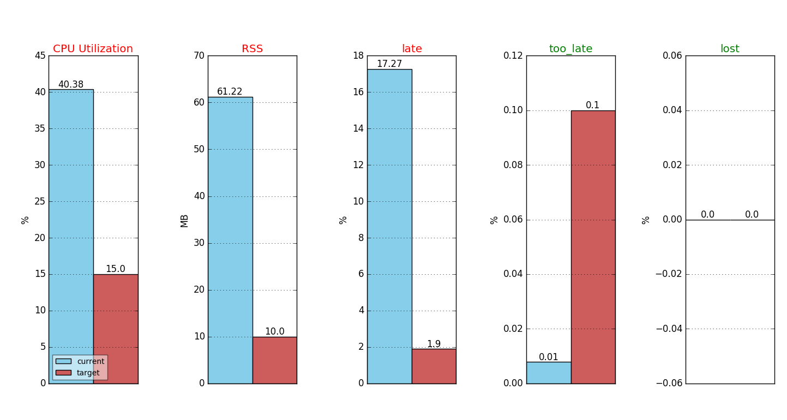
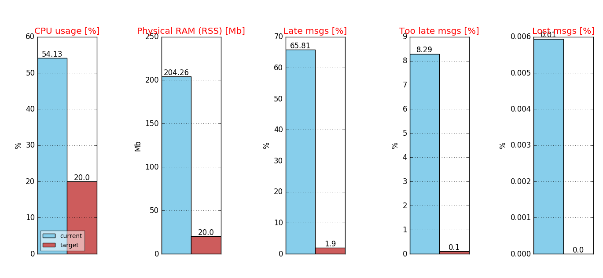

# Benchmark Application

This repository contains a benchmark application to test the performance of a ROS2 system. To run this benchmark, the user needs to provide a specific topology to simulate, in the form of a .json file. The application will load the complete ROS2 system from the topology file and will start doing dummy-message passing between the different nodes. Meanwhile, statistical data will be collected, such as the usage of resources (CPU utilization and RAM consumption) and message latencies. The application will run for a user-specified amount of time, and will output the results as human-readable log files. Tools to plot these results are provided.

### Topologies

Two default topologies are provided in the [topology](topology) folder, called [Sierra Nevada](topology/sierra_nevada.pdf) and [Mont Blanc](topology/mont_blanc.pdf). Sierra Nevada is light 10-node system while Mont Blanc is a heavier and more complex 20-node system.


### Building

The repository is based on the [performance_test](../performance_test) library.

To build:

```
mkdir -p performances_ws/src
cp -R <path to performances> performances_ws/src
cd performances_ws/src
colcon build --merge-install
```

It's possible to build and run this application on standard laptops as well as on embedded platforms.
You can follow these instructions for cross-compiling for RaspberryPi [cross-compiling](../../cross-compiling).


### Running

First, source the environment:

```
source performances_ws/src/install/local_setup.bash
```

Run:

```
cd performances_ws/src/install/lib/benchmark
./benchmark topology/sierra_nevada.json -t 60 --ipc on
```

This will run Sierra Nevada for 60 seconds and with *Intra-Process-Communication* activated. For more options, run `./benchmark --help`.


### Output

After running the application, a folder **log** will be created along with four different files inside it: 
- latency_all.txt
- latency_total.txt
- resources.txt
- events.txt


### Evaluation results

The following are sample files that have been obtained running Sierra Nevada on a RaspberryPi 3.


**latency_all.txt**:
```
node        topic       size[b]   received[#]   late[#]   too_late[#] lost[#]   mean[us]  sd[us]    min[us]   max[us]   freq[hz]    duration[s]
lyon        amazon      36        6001          46        0           0         849       293       281       8496      100         60        
hamburg     danube      8         6000          1598      1           0         1812      414       673       5478      100         60        
hamburg     ganges      16        6000          22        1           0         617       212       244       5237      100         60        
hamburg     nile        16        6001          36        1           0         686       261       255       5617      100         60        
hamburg     tigris      16        6001          163       1           0         920       449       263       7645      100         60        
osaka       parana      12        6000          1992      0           0         1804      646       404       7969      100         60        
mandalay    danube      8         6000          1030      0           0         1675      389       449       5165      100         60        
mandalay    salween     48        601           3         0           0         2273      915       481       8992      10          60        
ponce       danube      8         6000          1360      0           0         1763      417       584       6310      100         60        
ponce       missouri    10000     601           2         0           0         2478      905       450       5447      10          60        
ponce       volga       8         121           1         0           0         1731      773       351       5548      2           60        
barcelona   mekong      100       121           2         0           0         1710      1274      351       10975     2           60        
georgetown  lena        50        601           11        0           0         2463      1002      354       7369      10          60        
geneva      congo       16        601           1         0           0         973       493       283       9479      10          60        
geneva      danube      8         6000          2240      0           0         1915      468       542       7475      100         60        
geneva      parana      12        6000          2414      0           0         1953      714       458       8658      100         60        
arequipa    arkansas    16        601           3         1           0         1180      1229      334       23719     10          60
```

**latency_total.txt**:
```
received[#]     late[#]     late[%]     too_late[#]     too_late[%]     lost[#]     lost[%]     
63250           10924       17.27       5               0.007905        0           0      
```

There are different message classifications depending on their latency. A message is classified as **too_late** when its latency is greater than `min(period, 50ms)`, where `period` is the publishing period of that particular topic. A message is classified as **late** if it's not classified as **too_late** but its latency is greater than `min(0.2*period, 5ms)`. The idea is that a real system could still work with a few **late** messages but not **too_late** messages. Note that there are CL options to change these thresholds (for more info: `./benchmark --help`). A **lost** message is a message that never arrived. We can detect a lost message when the subscriber receives a message with a tracking number greater than the one expected. The assumption here is that the messages always arrive in chronological order, i.e., a message A sent before a message B will either arrive before B or get lost, but will never arrive after B. The rest of the messages are classified as **on_time**.

```
Message classifications by their latency


+                               +                               +
|                               |                               |
|                               |                               |
|                               |                               |
|                               |                               |
|                               |                               |
+-------------------------------+-------------------------------+

<--------><---------------------><----------------------------------->
 on_time           late                          too_late

<------------------------------->
             period
```

**resources.txt** (trimmed to fit):
```
time[ms]     cpu[%]  arena[KB]      in_use[KB]     mmap[KB]       rss[KB]        vsz[KB]        
0            0       0              0              0              0              0              
500          63      89172          88936          0              28268          329144         
1000         72      151592         151388         0              41136          458264         
1500         74      198872         198520         0              52660          571892         
2000         74      229088         228971         0              60616          601780         
2500         66      231664         231440         0              61536          685876         
3001         62      231672         231495         0              61536          685876         
3500         59      231704         231539         0              61536          685876         
4000         56      231760         231609         0              61796          685876         
4500         54      231784         231638         0              61796          685876         
5000         53      231828         231687         0              61796          685876         
5500         52      231880         231739         0              61796          685876         
6000         51      232024         231800         0              61796          686900         
6500         50      232032         231834         0              61796          686900         
7000         48      232032         231853         0              61796          686900         
7500         48      232036         231866         0              61796          686900         
8000         47      232036         231905         0              61796          686900         
8500         46      232060         231938         0              61796          686900         
9000         46      232088         231954         0              62060          686900         
9500         45      232228         231966         0              62108          687028         
10000        44      232256         231997         0              62108          687028         
10500        44      232292         232031         0              62108          687028         
11000        43      232312         232061         0              62108          687028         
11500        43      232328         232081         0              62108          687028         
12000        43      232344         232101         0              62108          687028         
12500        42      232376         232135         0              62108          687028         
13000        42      232400         232164         0              62108          687028         
13500        42      232416         232177         0              62108          687028         
14000        41      232448         232216         0              62108          687028         
14500        41      232460         232228         0              62108          687028         
15000        41      232488         232256         0              62108          687028         
15500        41      232508         232280         0              62108          687028         
16000        41      232528         232298         0              62108          687028         
16500        40      232560         232331         0              62108          687028         
17000        40      232584         232361         0              62108          687028         
17500        40      232624         232404         0              62108          687028         
18000        40      232648         232433         0              62108          687028         
18500        40      232684         232466         0              62372          687028         
19000        39      232716         232505         0              62372          687028         
19500        39      232740         232528         0              62372          687028         
20000        39      232820         232616         0              62372          687028
```

The resources utilization are sampled periodically every 0.5 seconds (can be changed with the option `--sampling`). The utilization of the CPU is measured over the total cores, i.e., a 100% CPU utilization on a 4-core platform means that all 4 cores are 100% busy. The fields **arena**, **in_use** (uordblks) and **mmap** (hblkhd) are obtained by calling [mallinfo](http://man7.org/linux/man-pages/man3/mallinfo.3.html). These fields represent the total memory allocated by the `sbrk()` and `mmap()` system calls. The field **rss** is the actual allocated memory that was mapped into physical memory. Note that an allocated memory page is not mapped into physical memory until the executing process demands it ([demand paging](https://en.wikipedia.org/wiki/Demand_paging)). **vsz** represents the size of the virtual memory space. For our benchmark, **rss** is the most important memory metric. 

**events.txt** (trimmed to fit):
```
Time[ms]    Caller                   Code  Description         
61          SYSTEM                   0     [discovery] PDP completed
420         SYSTEM                   0     [discovery] EDP completed
423         amazon->lyon             1     msg 0 late. 2028us > 2000us
427         danube->mandalay         1     msg 0 late. 2136us > 2000us
427         danube->geneva           1     msg 0 late. 2625us > 2000us
428         danube->ponce            1     msg 0 late. 3098us > 2000us
434         mekong->barcelona        1     msg 0 late. 10975us > 5000us
435         nile->hamburg            2     msg 0 too late. 12835us > 10000us
436         tigris->hamburg          2     msg 0 too late. 14789us > 10000us
436         ganges->hamburg          2     msg 0 too late. 11123us > 10000us
436         danube->hamburg          2     msg 0 too late. 11146us > 10000us
436         nile->hamburg            1     msg 1 late. 5617us > 2000us
436         tigris->hamburg          1     msg 1 late. 7645us > 2000us
437         ganges->hamburg          1     msg 1 late. 3995us > 2000us
438         danube->mandalay         1     msg 1 late. 3312us > 2000us
440         parana->osaka            1     msg 0 late. 5419us > 2000us
440         danube->geneva           1     msg 1 late. 4212us > 2000us
440         danube->hamburg          1     msg 1 late. 5478us > 2000us
440         parana->osaka            1     msg 1 late. 4888us > 2000us
440         parana->geneva           1     msg 0 late. 6032us > 2000us
440         parana->geneva           1     msg 1 late. 5246us > 2000us
441         danube->ponce            1     msg 1 late. 6310us > 2000us
441         tigris->hamburg          1     msg 2 late. 2478us > 2000us
448         danube->mandalay         1     msg 2 late. 2701us > 2000us
448         danube->hamburg          1     msg 2 late. 2760us > 2000us
448         danube->geneva           1     msg 2 late. 2788us > 2000us
448         danube->ponce            1     msg 2 late. 2417us > 2000us
457         danube->ponce            1     msg 3 late. 2219us > 2000us
457         danube->hamburg          1     msg 3 late. 2745us > 2000us
467         danube->hamburg          1     msg 4 late. 2366us > 2000us
487         danube->hamburg          1     msg 6 late. 2618us > 2000us
487         danube->ponce            1     msg 6 late. 2977us > 2000us
487         danube->geneva           1     msg 6 late. 3208us > 2000us
487         danube->mandalay         1     msg 6 late. 2810us > 2000us
488         parana->osaka            1     msg 6 late. 2754us > 2000us
488         parana->geneva           1     msg 6 late. 3317us > 2000us
490         missouri->ponce          1     msg 1 late. 5447us > 5000us
496         danube->geneva           1     msg 7 late. 2137us > 2000us
497         danube->ponce            1     msg 7 late. 2286us > 2000us
497         parana->geneva           1     msg 7 late. 2052us > 2000us
506         danube->ponce            1     msg 8 late. 2068us > 2000us
```

This file stores special events with their associated timestamp, such as:
- late message
- too late message
- lost message
- system nodes discovery

### Target performace

The target performance for different topologies on specific platforms can be found in the folder [performance_target](performance_target). For example, [sierra_nevada_rpi3.json](performance_target/sierra_nevada_rpi3.json):

```
{
    "topology_file": "sierra_nevada.json",
    "platform": "rpi3 b 1.2",
    "additional_options": "-t 600 --ipc on -s 1000 --late-percentage 20 --late-absolute 5000 --too-late-percentage 100 --too-late-absolute 50000",
    "comments": "scaling governor should be set to 'performance' at 800MHz",
    "resources": {
        "cpu[%]":   15,
        "rss[KB]":  10240
    },
    "latency_total": {
        "late[%]":      1.9,
        "too_late[%]":  0.1,
        "lost[%]":      0.0
    }
}
```

### Plotting

After you have run the application, you can plot the results using the plot scripts described in the [performance_test](../performance_test) library.

Moreover, it's possible to directly compare the results with a performance target defined in a *.json* file. For example, you can run:

```
python3 <path_to_performance_test_pkg>/scripts/plot_scripts/benchmark_app_evaluation.py --target <path_to_benchmark_pkg>/performance_target/sierra_nevada_rpi3.json --resources log/resources.txt --latency log/latency_total.txt
```

Also, you can use the performance target *.json* file together with the `cpu_ram_plot.py` script

```
python3 <path_to_performance_test_pkg>/scripts/plot_scripts/cpu_ram_plot.py log/resources.txt --x time --y cpu --y2 rss --target <path_to_benchmark_pkg>/perf_target.json
```

### Results

For reference only, these are the results obtained by running the default topologies on an RPi3 using ROS2 Crystal.

#### Sierra Nevada


#### Mont Blanc

