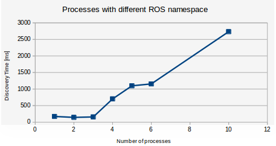
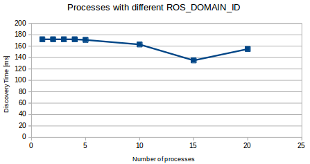

# Discovery time - Intraprocess

We want to measure how much time does it take for a publisher to discover all its subscribers.
Note that in these tests we run nodes all in the same process.


For more details on this topic refer to the [regression tests experiments](../regression/README.md).

Each of the provided executables monitors the discovery time, measuring how much time is required for the PDP and EDP phases, i.e. how much time does it take before every node has discovered all the others and how much time does it take for all publishers and subscribers to be matched.

The output can be found in the `events_*.txt` file.

In the following experiments we are going to use the `simple_pub_sub_main` executable. Note that we use a duration of 0 seconds since we are only interested in the discovery phase.

In order to test different systems, we provide different numbers of publishers and subscribers nodes.

For example:

```
ros2 run performance_test simple_pub_sub_main --duration 0 --pubs 1 --subs 5
```

Read about the discovery phase in Fast-RTPS [here](https://eprosima-fast-rtps.readthedocs.io/en/latest/advanced.html#discovery).

##### FastRTPS

 - **1 publisher 5 subscribers**: 10 milliseconds.
 - **1 publisher 10 subscribers**: 40 milliseconds (30% of the tests labeled as outliers with a discovery time of 40 seconds).
 - **1 publisher 15 subscribers**: 100 milliseconds (50% of the tests labeled as outliers with a discovery time of 40 seconds).

##### OpenSplice

The discovery time is less than 10 milliseconds even in case of 50 nodes or more.

##### Connext

Not able to run more than 8 nodes.

 - **1 publisher 7 subscribers**: 10% of the tests took 10 milliseconds. 30% of the tests took 2.8 seconds. 40% of the tests took 5.8 seconds. 10% of the tests timed out at 100 seconds.

# Discovery time - Interprocess

Here we measure the discovery time of ROS systems running simultaneously, each under a different process. If all the ROS systems were to use the same topic name, the publishers of different processes would discover the subscribers present in all other processes. To avoid this, we try two approaches:

1. Use different ROS2 **namespaces** for each system:

Nodes are said to be in a namespace or have a default namespace. Relative names are appended to the namespace of the node which creates them, for example a publisher who publishes to a topic "*/my_topic*" using a namespace "*my_namespace*", will end up publishing to a topic called "*/my_namespace/my_topic*".

```
ros2 run performance_test simple_pub_sub_main --duration 0 --pubs 1 --subs <N_SUBS> --ros_namespace <NAME1>
ros2 run performance_test simple_pub_sub_main --duration 0 --pubs 1 --subs <N_SUBS> --ros_namespace <NAME2>
ros2 run performance_test simple_pub_sub_main --duration 0 --pubs 1 --subs <N_SUBS> --ros_namespace <NAME3>
```

Note that when using this approach, creating for example five ROS systems with each 1 pub and 5 subs will have a total of 30 nodes running on the same network. The discovery time for a publisher node will be longer than if running only one system, because it will have to discover much more nodes before finding the ones that are subscribing to its topic.

2. Use different **ROS_DOMAIN_ID** for each system:

The `ROS_DOMAIN_ID` is like a logical barrier to segregate networks. It is used to specify which set of UDP ports will be used by a process. This means that the nodes in two processes with different `ROS_DOMAIN_ID` will never see each other.

```
ROS_DOMAIN_ID=<ID1> ros2 run performance_test simple_pub_sub_main --duration 0 --pubs 1 --subs <N_SUBS>
ROS_DOMAIN_ID=<ID2> ros2 run performance_test simple_pub_sub_main --duration 0 --pubs 1 --subs <N_SUBS>
ROS_DOMAIN_ID=<ID3> ros2 run performance_test simple_pub_sub_main --duration 0 --pubs 1 --subs <N_SUBS>
```

`ROS_DOMAIN_ID` allows us to use the same topic names on each system and still publisher won't discover subscribers of other processes than its own. In the case of five ROS systems with 1 pub and 5 subs each, the discovery phase will be simpler than in the previous case because each publisher node will only have other nodes to discover, no matter how many ROS systems are running simultaneously (if they all have set a different ROS_DOMAIN_ID).


#### Fast-RTPS experiment

Setting: ROS2 Crystal Master - FastRTPS 1.7.2 - x86_64

Test: Multiple processes running each a ROS system made up by:

 - **1 publisher 5 subscribers**

1. Using different ROS2 namespaces for each system:



The discovery time increases when increasing the amount of nodes running under the same network.

2. Using different ROS_DOMAIN_ID for each system:



The discovery time remains constant regardless or the amount of processes, due all of them are under a different ROS_DOMAIN_ID. Note that in the case of 20 processes there are 120 nodes running simultaneously.

