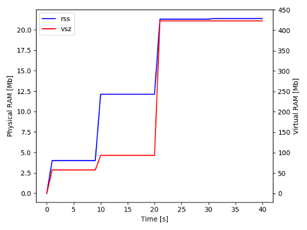
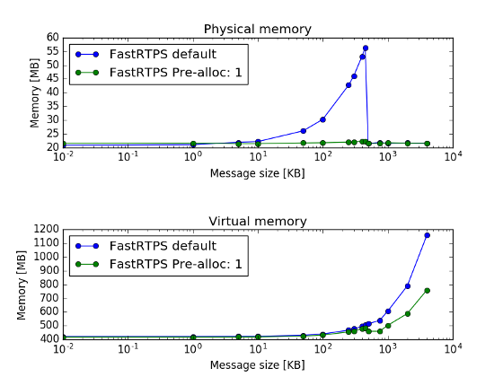
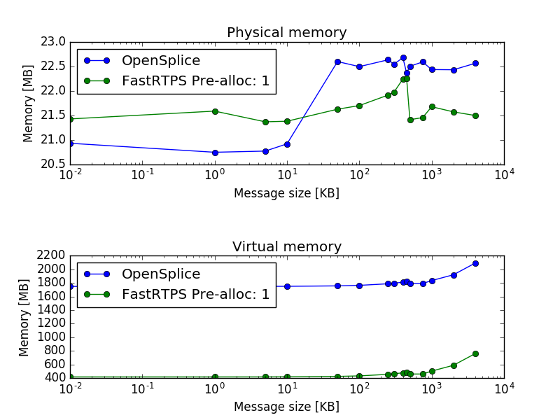
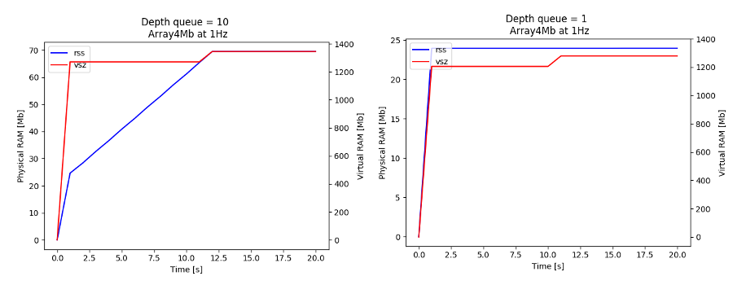

# ROS2 Pub/Sub memory usage

**Note:** This memory tests have been carried out using ROS2 Crystal Patch 1 version, which is affected by a problem in the memory usage.
This is documented more in details in the [regression](../regression/README.md) page.

We are going to measure the memory usage from the C++ code through the `getrusage` function and reading the `/proc/<ID>` system files.
Moreover, note that for simple experiments, you can get valid results using external tools such as `ps` or `top`.


#### General memory evaluation [x86_64]

The simplest way for measuring the memory usage of a process consits in using the standard Linux tool `ps`.

For example:

```
ros2 run examples_rclcpp_minimal_publisher publisher_lambda
ps aux | grep publisher_lambda
```

Note that among the results "grepped" from `ps` you will find not only your process of interest, but also the ROS2 CLI which is executing it and the grep command itself.
Be careful to look only at the correct one!

To avoid confusion, you may want to directly run the executable instead of using the ROS2 CLI:

```
/path/to/ros2/ws/install/examples_rclcpp_minimal_publisher/lib/examples_rclcpp_minimal_publisher/publisher_lambda
ps aux | grep publisher_lambda
```

Running some of the default nodes, we get the following results.

| ROS2 system | Distribution | DDS        |  Physical RAM  | Virtual RAM
| ------------- | ------------- | ------------- | ------------- | ------------- |
| FastRTPS participant   |   | FastRTPS 1.7.0  | 15MB    | 215MB
| publisher_lambda   | Crystal  | FastRTPS   | 20MB    | 420MB
| publisher_lambda   | Crystal  | Opensplice | 24MB    | 1.7GB
| publisher_lambda   | Crystal  | Connext | 36MB    | 1.75GB

The memory requirement for the simplest types of node is quite high, expecially for what concerns the Virtual memory requirement; this last value reaches the kind of suspicious value of 1.7GB for a single node when using OpenSplice.
There are no noticeable differences between publisher and subscribers.

Let's look at when is this memory allocated.

In the following plot we examine the lifetime of a simple subscriber node, with a 10 seconds pause between each of the following function calls: `main()`, `rclcpp::init()`, `std::make_shared<SimpleSubscriberNode>()`, `rclcpp::shutdown()`.

As we can see, the static memory allocated at startup is 4MB and this is almost entirely due to the presence of the `rclcpp::init()` function (creating a process with just this function statically allocates almost the same amount of memory).
Actually calling this function, at second 10, allocates additional 8MB. Then, at second 20, we create the node and this causes an allocation of additional 10 MB. Note that calling `rclcpp::shutdown()` at second 30, does not release any memory.

Thus, in a ROS2 process, approximately 10 MB of RAM are required for creating each node.




From the phyisical RAM point of view there is not much difference in creating a single FastRTPS participant or a ROS2 node.
Note that the ROS2 node actually always contains more than 1 participant (for example the parameters server, the time subscriber and the events subscriber).

#### Varying the message size [x86_64]

In order to run more complex tests, varying the number of nodes or their parameters, we can use the bash scripts provided with this package and then plot the results.

In this case we are going to mostly use the `scripts/only_subs.sh` script, as it will create systems with only subscribers.
Note that the `MAX_PUBLISHERS` is still used and in this case denotes how many subscriptions each node will have.

```
$ source env.sh
$ export MAX_PUBLISHERS=1
$ export MAX_SUBSCRIBERS=1
$ export MSG_TYPES="10b 100b 250b 1kb 10kb 250kb 1mb 4mb 8mb"
$ export DURATION=10
$ export NUM_EXPERIMENTS=5
$ bash scripts/only_subs.sh
$ python3 scripts/plot_scripts/cpu_ram_plot.py results/only_subs_ros2/cpu_ram* --x subs --y rss --y2 vsz
```

| ROS2 system | Distribution | DDS        |  Physical RAM  | Virtual RAM
| ------------- | ------------- | ------------- | ------------- | ------------- |
| 1 node subscribing 10b topic  | Crystal      | FastRTPS   | 22MB           | 500MB
| 1 node subscribing 4MB topic  | Crystal      | FastRTPS   | 22MB           | 1.2GB
| 1 node subscribing 4MB topic  | Crystal      | OpenSplice | 28MB           | 2.1GB


With both the DDS tested, at a first glance it may look like the type of message and its dimension are not influencing the allocated memory for the subscription in a noticeable way.

The virtual memory with FastRTPS increases porportionally to the size of the messages and to the number of subscriptions.
On the other hand, with OpenSplice, the differences in virtual memory between different message sizes are way smaller.

However, repeating the experiment for a broader set of message sizes, it's possible to note a strange increment in the physical memory usage for FastRTPS and messages in the range 10KB - 500KB.

The reason of the memory increase in FastRTPS is explained [here](https://github.com/ros2/rmw_fastrtps/issues/257):

"*One thing to keep in mind is that when creating publishers and subscribers, the RMW implementation might choose to preallocate a number of message instances.
That is usually limited to smaller messages where as larger messages might only be allocated dynamically. That might be a reason for your drop in the plot.*"

This is what we see when messages are bigger than 500KB, the memory usage drops because messages of this size are not preallocated by default.
For messages smaller than 500KB, FastRTPS will pre-allocate space for 100 message instances by default.
This behavior can be changed through a FastRTPS XML profile.

The following plot shows the difference between using the default number of pre-allocated messages and when this value is set to 1.
For example, in case of a 100KB message, the difference is exactly 10MB as this is the size of the 100 pre-allocated messages.





Here you can see the memory requirements of FastRTPS with a number of pre-allocated messages of 1 and of OpenSplice with its default configuration, with respect to the different message sizes.




#### Adding more participants in the same node [x86_64]


Now let's try to understand how things scale.
In the following tests we are interested only in the creation of publisher/subscription objects. Thus no messages are actually created, sent or received.

```
$ source env.sh
$ export MAX_PUBLISHERS=10
$ export MAX_SUBSCRIBERS=1
$ export MSG_TYPES=10b
$ export DURATION=10
$ export NUM_EXPERIMENTS=5
$ bash scripts/only_subs.sh
$ python3 scripts/plot_scripts/cpu_ram_plot.py results/only_subs_ros2/cpu_ram* --x subs --y rss --y2 vsz
```

Trying to add publishers/subscriptions inside the same node, it seems to scale pretty well.

| ROS2 system | Distribution | DDS        |  Physical RAM  | Virtual RAM
| ------------- | ------------- | ------------- | ------------- | ------------- |
| 1 node subscribing 1 10b topic  | Crystal      | FastRTPS   | 22MB           | 500MB
| 1 node subscribing 2 10b topic  | Crystal      | FastRTPS   | 22MB           | 500MB
| 1 node subscribing 40 10b topic | Crystal      | FastRTPS   | 24MB           | 500MB
| 1 node subscribing 1 10b topic  | Crystal      | OpenSplice | 27MB           | 1.8GB
| 1 node subscribing 2 10b topic  | Crystal      | OpenSplice | 27MB           | 1.8GB
| 1 node subscribing 40 10b topic | Crystal      | OpenSplice | 30MB           | 1.8GB

There are almost no differences in adding more publishers/subscribers of the same type to a node.
The increases in both physical and virtual memory are noticeable only when a node is creating 10s of subscriptions.

However, note that things scale differently when you are subscribing to bigger messages, as each subscription has to allocate space for several messages. This amount of space was negligible in case of the 10 bytes subscriptions, but can become extremely high for bigger ones.

| ROS2 system | Distribution | DDS        |  Physical RAM  | Virtual RAM
| ------------- | ------------- | ------------- | ------------- | ------------- |
| 1 node subscribing 1 4MB topic       | Crystal      | FastRTPS   | 22MB           | 1.2GB
| 1 node subscribing 40 4MB topic    | Crystal      | FastRTPS   | 40MB           | 31GB
| 1 node subscribing 1 4MB topic       | Crystal      | OpenSplice | 28MB           | 2.1GB
| 1 node subscribing 40 4MB topic    | Crystal      | OpenSplice | 29MB           | 16GB


In the previous example, we considered subscriptions all of the same type, however, requirements are almost unchanged even when dealing with nodes subscribing to different types of topics.

| ROS2 system | Distribution | DDS        |  Physical RAM  | Virtual RAM
| ------------- | ------------- | ------------- | ------------- | ------------- |
| 1 node subscribing 10b and 100b topic    | Crystal      | FastRTPS   | 22MB           | 500MB
| 1 node subscribing 10b and 100b topic    | Crystal      | OpenSplice   | 27MB           | 1.8GB


#### Adding more nodes [x86_64]

Now let's see what happens when using more real ROS2 systems.
In this experiments we are going to create several subscriber nodes in the same process. There are no noticeable differences if the nodes are subscribing to the same or to different topics (even if the message type is different).

```
$ source env.sh
$ export MAX_PUBLISHERS=1
$ export MAX_SUBSCRIBERS=20
$ export MSG_TYPES=10b
$ export DURATION=10
$ export NUM_EXPERIMENTS=5
$ bash scripts/only_subs.sh
$ python3 scripts/plot_scripts/cpu_ram_plot.py results/only_subs_ros2/cpu_ram* --x subs --y rss --y2 vsz
```


| ROS2 system | Distribution | DDS        |  Physical RAM  | Virtual RAM
| ------------- | ------------- | ------------- | ------------- | ------------- |
| 1 node subscribing 10b topic   | Crystal      | FastRTPS   | 22MB           | 500MB
| 2 node subscribing 10b topic   | Crystal      | FastRTPS   | 31MB           | 950MB
| 5 node subscribing 10b topic   | Crystal      | FastRTPS   | 62MB           | 1.3GB
| 10 node subscribing 10b topic   | Crystal      | FastRTPS   | 135MB           | 2.1GB
| 20 node subscribing 10b topic   | Crystal      | FastRTPS   | 352MB           | 3.5GB
| 1 node subscribing 10b topic   | Crystal      | OpenSplice | 27MB           | 1.8GB
| 2 node subscribing 10b topic   | Crystal      | OpenSplice   | 29MB          | 2.1GB
| 20 node subscribing 10b topic  | Crystal      | OpenSplice | 57MB           | 2.33GB


Here we see big differences between the two DDS.

FastRTPS has a smaller memory usage when we are considering a system with a single node.
However, it looks like that the memory requirement for each additional node is not constant and it's increasing.
The first nodes will take approximately 10MB each, but when considering a system with 20 nodes, adding an additional one will cause an overhead of more than 20MB.

On the other hand OpenSplice scales way better. Again the memory requirement is not constant, but it decreases with the number of nodes in the system.
Creating an additional node in a system with 20 nodes requires less than 1MB.


#### Queue depth [x86_64]

When a subscriber is created, it will start receiving messages even if its node does not spin.
Messages will be processed when the node spins, but until that happens they will be added to a queue.

In the left plot, we can see the memory requirements of a node subscribing to a 4MB topic which waits 10 seconds before spinning.
The publisher is sending messages at a frequency of 1Hz, thus we can see the physical memory increase of approximately 4MB every second.
The memory stabilizes as soon as the node start processing messages.

There are two ways for avoiding this dynamic memory allocation: limiting the depth of the queue to 1 with the QoS parameter, or pre-allocating more messages than the queue depth using the XML QoS settings.
Note that in this example, i.e. with a 4MB message, pre-allocation was disabled by default due to the big size of the message.

In the right plot, you can see the results from the same experiment, but with the depth of the queue set to 1.



Note that the use of the queue is relevant also if a subscriber is not fast enough for processing all the published messages.


#### Static vs Dynamically allocated message fields [x86_64]

When using ROS2 on an embedded platform keeping all the nodes in the same process, the virtual memory can become a problem.
The reason is that 32 bit architectures can't allocate more than 4GB of Virtual Memory per process (actually the real limit is lower as part is occupied by the kernel, this is approximately 1GB on Linux).

Using dynamic message fields can solve this problem.

To demonstrate this statement, we created some publisher/subscriber systems with a varying number of nodes.
The depth of the queue has been set to 1, to avoid queued messages to contribute to the overall memory allocation.

In the first set of plots, you can see that for a message which is small in size (approximately 20 bytes), there are almost no differences from a memory point of view in using static or dynamic fields in the message definitions.

However, the second set of plots shows the results for a 4MB message.
Here the difference in the Virtual Memory usage is evident as, a system with 5 nodes (1 pub 4 sub) with static fields requires 3GB of Virtual Memory. This is actually a limit experiment, as we are not able to add another node in that process.
On the other hand, the same system with 5 nodes but with dynamic message fileds, takes less than 500MB, which is not too much than the same system in the 10 bytes scenario.


### Memory evaluation [RaspberryPi2]

Note that in this table, the publisher nodes are publishing messages even if no subscriber is present and, similarly, subscriber nodes are spinning even if no one is publishing.
For this reason the `1 pub 4MB topic` node has an higher physical RAM usage: it's creating messages of size 4MB.

The first thing we note is the smaller memory required for running nodes inside the RaspberryPi2.
For the laptop the physical RAM used by the `publisher_lambda` node was `17MB` and `20MB` for Bouncy and Crystal respectively.
Moreover also the difference between the two distributions is smaller.
As on the laptop, there is almost no difference with respect to the physical memory changing the type of message.


| ROS2 system | Distribution | DDS        |  Physical RAM  | Virtual RAM
| ------------- | ------------- | ------------- | ------------- | ------------- |
| subscriber_lambda       | Crystal      | FastRTPS   | 12MB           | 80MB
| publisher_lambda        | Crystal      | FastRTPS   | 12MB           | 80MB
| 1 pub 10b topic      | Crystal      | FastRTPS   | 13MB           | 90MB
| 1 pub 4MB topic         | Crystal      | FastRTPS   | 17MB           | 340MB
| 1 sub 10b topic      | Crystal      | FastRTPS   | 13MB           | 89MB
| 1 sub 4MB topic         | Crystal      | FastRTPS   | 13MB           | 698MB


Running bigger systems we observe the following.

Here is the first problem we found: on a 32 bit architecture, like RaspberryPi2, the amount of virtual memory of a single process is limited and thus for example creating a system with 5 subscribers nodes and 1 publisher node, all on 4MB topic will cause an out of memory error.

| ROS2 system | Distribution | DDS        |  Physical RAM  | Virtual RAM
| ------------- | ------------- | ------------- | ------------- | ------------- |
| 1 node subscribing 10b topic   | Crystal       | FastRTPS   | 13MB           | 90MB
| 2 node subscribing 10b topic   | Crystal       | FastRTPS   | 18MB           | 144MB
| 5 node subscribing 10b topic   | Crystal       | FastRTPS   | 38MB           |326MB
| 10 node subscribing 10b topic   | Crystal       | FastRTPS   | 78MB           | 677MB
| 20 node subscribing 10b topic   | Crystal      | FastRTPS   | 216MB           | 1.56GB
| 5 sub 1 pub 10b topic           | Crystal      | FastRTPS   | 44MB           | 360MB
| 20 sub 5 pub 10b topic          | Crystal      | FastRTPS   | 289MB          | 1.9GB


